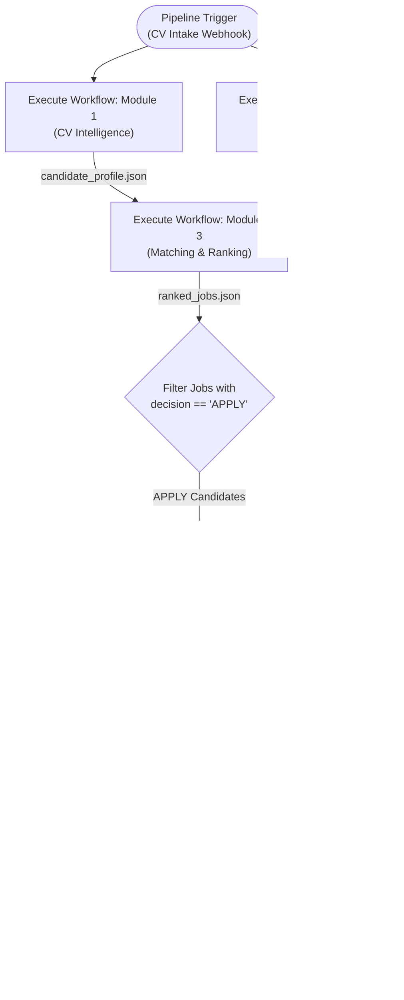

# System Integration & Master Pipeline
**Owner:** Integration Lead

## Overview
This directory contains the master n8n workflow (`Complete_Job_Hunter.json`) and the integration smoke-testing suite connecting all five independent modules into an end-to-end autonomous pipeline.

---

## Integration Architecture

---

## Pairwise Integration Checklist (Milestone 5)

Per Section 5 of the brief, connect in pairs to isolate failures:

| Step | Connection | Verification Check | Status |
|---|---|---|---|
| **Step 1** | **M1 $\rightarrow$ M3** | Feed live M1 output into M3 with `sample_jobs.json`. Confirm M3 scores without schema errors. | `[READY TO RUN]` |
| **Step 2** | **M2 $\rightarrow$ M3** | Feed live M2 output into M3 with `sample_candidate_profile.json`. Check normalization. | `[READY TO RUN]` |
| **Step 3** | **(M1 + M2) $\rightarrow$ M3** | Full upstream integration producing real `ranked_jobs.json`. | `[READY TO RUN]` |
| **Step 4** | **M3 $\rightarrow$ M4** | Feed top-ranked `APPLY` vacancy into M4. Confirm factual consistency. | `[READY TO RUN]` |
| **Step 5** | **M4 $\rightarrow$ M5** | Feed generated package into M5. Verify approval gate, mock submission, and tracking record. | `[READY TO RUN]` |
| **Step 6** | **End-to-End** | Full automated run from raw CV file to candidate email notification. | `[MILESTONE 6]` |

---

## Master Workflow File
- [`Complete_Job_Hunter.json`](./Complete_Job_Hunter.json): Pre-configured master pipeline using n8n `Execute Workflow` nodes.
