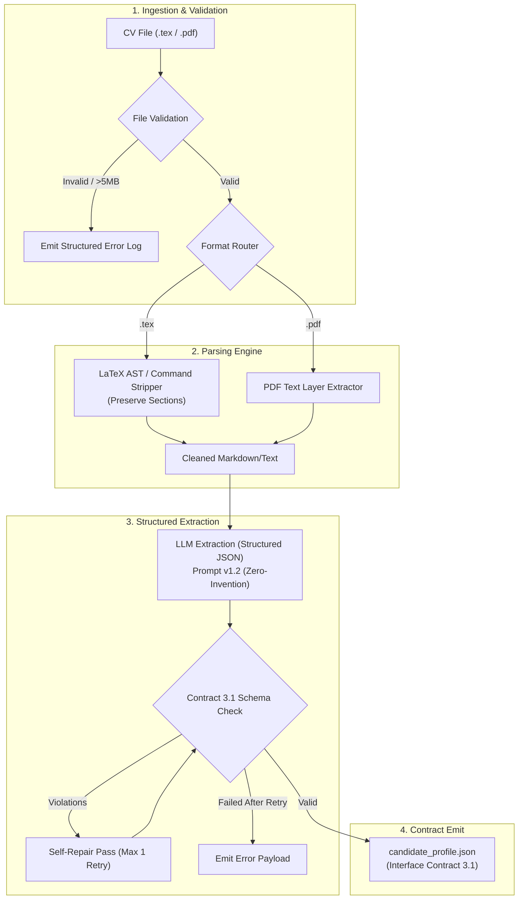

# Module 1: CV Intelligence
**Owner:** Student 1 (CV & AI Engineer)

## Overview
This module ingests arbitrary raw CV files (`.tex` or `.pdf`) and outputs a validated, structured JSON profile (`candidate_profile.json`) conforming strictly to Interface Contract 3.1. Downstream modules (specifically Module 3 and Module 2) rely directly on this payload to find vacancies and rank compatibility.

---

## Module Architecture & Dataflow

---

## Detailed Node Responsibilities

| Stage | Node Name | Description | Key Failure Modes Handled |
|---|---|---|---|
| **1. Ingest** | `Webhook / File Upload` | Receives raw CV data and metadata. | Missing payload, network timeouts. |
| **2. Validate** | `File Validator & Guard` | Checks MIME type, non-zero byte size, and 5MB ceiling. | Corrupt PDFs, non-CV files, oversized payloads. |
| **3. Strip & Parse** | `LaTeX / PDF Parser` | Strips LaTeX boilerplate while preserving section headers (`Work Experience`, `Skills`, etc.). | Broken LaTeX tags, custom macro expansions. |
| **4. Extract** | `LLM Structured Extractor` | Maps unstructured text to strict JSON fields. Prohibits hallucinating skills. | Malformed JSON output, omitted required fields. |
| **5. Repair Loop** | `Schema Validator & Repair` | Validates against Contract 3.1. Re-prompts the model if keys are missing. | Prevents pipeline crashes downstream. |

---

## Inputs and Outputs

- **Sample Input File:** [`test_data/sample_cv.tex`](./test_data/sample_cv.tex)
- **Output Schema:** [`../contracts/schemas/candidate_profile.schema.json`](../contracts/schemas/candidate_profile.schema.json)
- **Sample Output:** [`../contracts/sample_payloads/sample_candidate_profile.json`](../contracts/sample_payloads/sample_candidate_profile.json)

### Key Output Fields:
- `candidate_id`: String identifier carried across the entire pipeline.
- `experience_years`: Numeric total years of relevant experience.
- `technical_skills`, `programming_languages`, `frameworks`, `tools`: Typed string arrays.
- `keywords`: Market-facing query terms (e.g. `"Backend Engineer"`, `"Python Developer"`) specifically generated to drive Module 2 searches.
- `extraction_meta`: Model name, prompt version, timestamp, confidence score.

---

## Evaluation & Ground Truth Benchmark

To satisfy Section 6.2 evaluation requirements, this module is benchmarked against **5 hand-annotated ground truth CVs** in [`evaluation/ground_truth.json`](./evaluation/ground_truth.json).

### Measured Metrics:
1. **Precision, Recall & F1** across 4 key field groups:
   - Technical Skills
   - Tools & Frameworks
   - Education Records
   - Job Titles
2. **First-Pass JSON Validity**: Percentage of LLM responses conforming to schema before repair.
3. **Hallucination Rate**: `(Extracted items absent from source CV) / (Total items extracted)`. Target: `< 1.0%`.
4. **Latency & Cost**: Recorded median latency per CV and API cost per 1,000 processed CVs.

---

## Decision Records (ADRs)
- [`decisions/ADR-001-llm-model-selection.md`](./decisions/ADR-001-llm-model-selection.md): Weighted matrix justifying model choice (GPT-4o-mini vs Gemini 1.5 Flash vs Claude 3.5 Haiku).
- [`decisions/ADR-002-latex-text-extraction.md`](./decisions/ADR-002-latex-text-extraction.md): Regex section parsing vs external converter.

---

## Checklist to Mark Done
- [x] Runs standalone from a single test CV without needing any downstream modules.
- [x] Correctly validates and rejects all 5 negative test cases (empty, oversized, corrupt).
- [x] 100% of required Contract 3.1 fields populated or explicitly set to `null` with rationale.
- [x] Can defend every node and extraction choice in the individual oral review.
