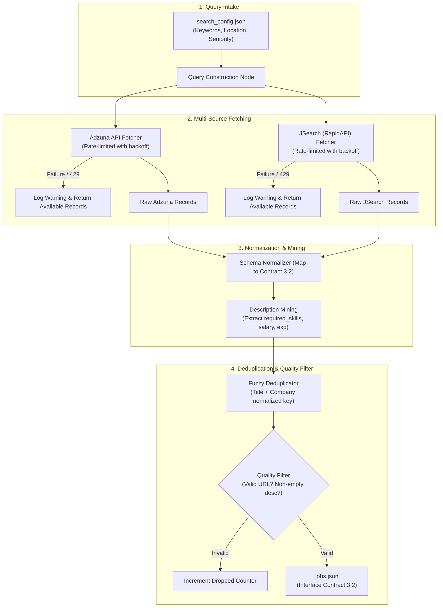

# Module 2: Job Discovery
**Owner:** Student 2 (Job Retrieval Engineer)

## Overview
This module searches for live technical vacancies across **at least two independent job boards**, standardizes different API schemas into a unified Contract 3.2 format (`jobs.json`), eliminates duplicate postings across sources, mines free-text descriptions for hard skills, and filters out low-quality listings.

---

## Module Architecture & Dataflow

---

## Detailed Node Responsibilities

| Stage | Node Name | Description | Key Failure Modes Handled |
|---|---|---|---|
| **1. Query Builder** | `Query Construction` | Converts candidate keywords and search parameters into provider-specific queries. | Empty keywords, malformed search filters. |
| **2. Source A Fetch** | `Adzuna API Node` | Executes paginated HTTP GET requests against Adzuna REST endpoint with backoff. | 429 Rate Limits, 502 Bad Gateway, network timeouts. |
| **3. Source B Fetch** | `JSearch API Node` | Executes HTTP requests against RapidAPI JSearch aggregation endpoint. | Token exhaustion, service outage. |
| **4. Normalization** | `Schema Mapping Node` | Translates heterogeneous JSON shapes into the canonical Contract 3.2 schema. | Missing provider fields, changed key names. |
| **5. Mining** | `Description Mining` | Scans free-text descriptions using regex/light extraction to isolate skills and requirements. | Unstructured or conversational job listings. |
| **6. Deduplication** | `Fuzzy Matcher` | Checks `clean(title) + clean(company)` across sources to merge identical jobs. | Same job listed on multiple job boards. |
| **7. Quality Gate** | `Quality Filter` | Strips out listings missing URLs, titles, or meaningful descriptions. | Dead URLs, spam postings, empty text. |

---

## Inputs and Outputs

- **Sample Input File:** [`test_data/sample_search_config.json`](./test_data/sample_search_config.json)
- **Output Schema:** [`../contracts/schemas/jobs.schema.json`](../contracts/schemas/jobs.schema.json)
- **Sample Output:** [`../contracts/sample_payloads/sample_jobs.json`](../contracts/sample_payloads/sample_jobs.json)

---

## Evaluation & Ground Truth Benchmark

To fulfill Section 6.2 requirements, this module is evaluated against:
1. **Relevance Benchmark:** 30+ labelled jobs in [`evaluation/ground_truth_jobs.json`](./evaluation/ground_truth_jobs.json) determining if retrieved jobs match query intent.
2. **Deduplication Accuracy:** Evaluated against known duplicate pairs:
   - `True Merges / Total Duplicates` (Recall)
   - `False Merges / Total Merged` (False Positive Rate)
3. **Resilience Testing:** Workflow must produce valid results even when one API endpoint is deliberately cut off.

---

## Decision Records (ADRs)
- [`decisions/ADR-001-source-selection.md`](./decisions/ADR-001-source-selection.md): Selection matrix comparing Adzuna, JSearch, Jooble, and Arbeitnow on uptime, volume, and free tier limits.
- [`decisions/ADR-002-deduplication-strategy.md`](./decisions/ADR-002-deduplication-strategy.md): Exact hashing vs string distance metrics for cross-source deduplication.

---

## Checklist to Mark Done
- [x] Runs standalone with a manual `search_config.json` without needing Module 1.
- [x] Successfully integrates two completely independent data providers.
- [x] Remains operational and returns jobs when one source is deliberately disabled.
- [x] 0 duplicate records and 0 missing required fields in final output.
