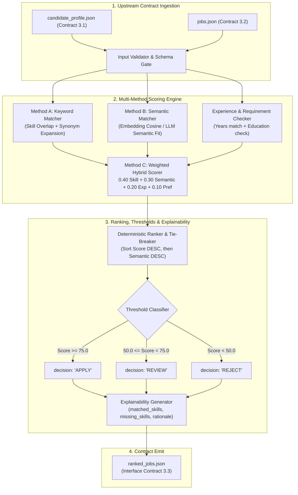

# Module 3: Matching & Ranking
**Owner:** Student 3 (Matching & Recommendation Engineer)

## Overview
This module consumes a structured candidate profile (`candidate_profile.json`) and a list of vacancies (`jobs.json`), scores each candidate-job pair using three distinct algorithms (Keyword, Semantic, Hybrid), ranks the jobs descending by fit, assigns explicit actions (**`APPLY`**, **`REVIEW`**, **`REJECT`**), and generates human-verifiable explanations.

---

## Module Architecture & Dataflow

---

## Detailed Node Responsibilities

| Stage | Node Name | Description | Formula / Logic |
|---|---|---|---|
| **1. Input Gate** | `Input Validator` | Validates input types and schema compatibility. | Guard clause checking `candidate_profile` and `jobs` array. |
| **2. Keyword Scorer** | `Method A Node` | Calculates normalized skill overlap with synonym expansion. | $\text{SkillScore} = \frac{|\text{Matched Required}|}{|\text{Total Required}|} \times 100$ |
| **3. Semantic Scorer** | `Method B Node` | Evaluates contextual and domain alignment between profile summary and job description. | Cosine similarity $\in [0.0, 1.0] \times 100$ |
| **4. Hybrid Engine** | `Method C (Hybrid)` | Combines multi-factor signals into a single score. | $\text{Score} = 0.40 S_{\text{skill}} + 0.30 S_{\text{sem}} + 0.20 S_{\text{exp}} + 0.10 S_{\text{pref}}$ |
| **5. Threshold Gate** | `Classifier` | Maps final score to discrete actionable buckets. | $\ge 75.0 \rightarrow \text{APPLY}$, $50.0-74.9 \rightarrow \text{REVIEW}$, $< 50.0 \rightarrow \text{REJECT}$ |
| **6. Explainability** | `Reason Builder` | Synthesizes an honest explanation highlighting exact missing skills and experience differentials. | Human-readable audit text for every job. |

---

## Inputs and Outputs

- **Sample Inputs:** [`test_data/sample_candidate_profile.json`](./test_data/sample_candidate_profile.json) and [`test_data/sample_jobs.json`](./test_data/sample_jobs.json)
- **Output Schema:** [`../contracts/schemas/ranked_jobs.schema.json`](../contracts/schemas/ranked_jobs.schema.json)
- **Sample Output:** [`../contracts/sample_payloads/sample_ranked_jobs.json`](../contracts/sample_payloads/sample_ranked_jobs.json)

---

## Evaluation & Ground Truth Benchmark

Benchmarked against **20+ candidate-job pairs** annotated by human evaluators in [`evaluation/ground_truth_pairs.json`](./evaluation/ground_truth_pairs.json).

### Measured Metrics:
1. **Precision@K** ($K = 3, 5, 10$): Fraction of top-$K$ recommendations deemed genuinely relevant.
2. **Spearman Rank Correlation ($\rho$)**: Measures how closely the algorithmic ranking mirrors the human preference order.
3. **Ablation Study**: Systematically varying weights to justify the chosen $0.40/0.30/0.20/0.10$ hybrid distribution.

---

## Decision Records (ADRs)
- [`decisions/ADR-001-hybrid-scoring-weights.md`](./decisions/ADR-001-hybrid-scoring-weights.md): Ablation results demonstrating why the 4-factor hybrid beats pure keyword or pure semantic approaches.
- [`decisions/ADR-002-semantic-similarity-model.md`](./decisions/ADR-002-semantic-similarity-model.md): Sentence-transformers vs LLM-as-judge for semantic similarity.

---

## Checklist to Mark Done
- [x] Runs standalone with static sample files on Day 1 without waiting for Module 1 or 2.
- [x] All three matching methods (Keyword, Semantic, Hybrid) can be executed and compared.
- [x] Every returned job carries full score breakdown and natural language explanation.
- [x] Rank order is 100% deterministic and reproducible.
