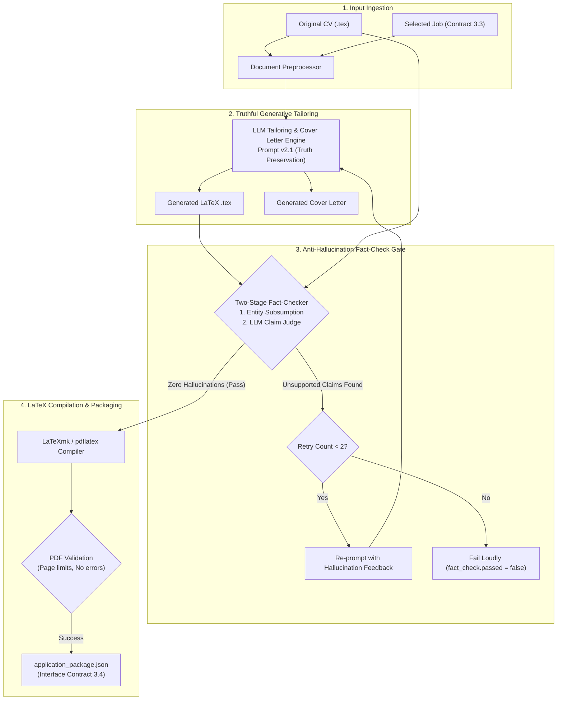

# Module 4: CV Tailoring & Documents
**Owner:** Student 4 (Generative AI & Document Engineer)

## Overview
This module takes the candidate's original CV (`sample_cv.tex`) and one top-ranked vacancy (`sample_selected_job.json`), re-orders and highlights true relevant achievements, generates a personalized cover letter, compiles a clean LaTeX PDF, and enforces a strict **anti-hallucination fact-checking gate** before producing the final Contract 3.4 payload (`application_package.json`).

---

## Module Architecture & Dataflow

---

## Detailed Node Responsibilities

| Stage | Node Name | Description | Hard Constraints Enforced |
|---|---|---|---|
| **1. Ingest** | `Document Preprocessor` | Extracts ground truth claims and sections from the source LaTeX file. | Preserves document class and packages. |
| **2. Tailor** | `LLM Tailoring Engine` | Rephrases summaries, re-orders bullet points, and writes a bespoke cover letter. | **Zero Invention Rule**: Never adds unverified skills, employers, or degrees. |
| **3. Fact-Check Gate** | `Fact-Checking Node` | Compares generated claims against original CV facts. | If `unsupported_claims > 0`, payload is NEVER emitted downstream. |
| **4. Compile** | `LaTeX Compiler` | Compiles `.tex` source into a formatted PDF document. | Catches missing brackets or unescaped LaTeX special characters. |
| **5. Packaging** | `Output Gate` | Assembles file paths, metadata, and compilation status into Contract 3.4. | Complete metadata with prompt version and timestamp. |

---

## Inputs and Outputs

- **Sample Inputs:** [`test_data/sample_cv.tex`](./test_data/sample_cv.tex) and [`test_data/sample_selected_job.json`](./test_data/sample_selected_job.json)
- **Output Schema:** [`../contracts/schemas/application_package.schema.json`](../contracts/schemas/application_package.schema.json)
- **Sample Output:** [`../contracts/sample_payloads/sample_application_package.json`](../contracts/sample_payloads/sample_application_package.json)

---

## Evaluation & Ground Truth Benchmark

Evaluated across **5 distinct test vacancies plus adversarial trap cases** in [`evaluation/rubric_evaluation.md`](./evaluation/rubric_evaluation.md):
1. **Factual Consistency Rate**: % of generated packages with exactly 0 unsupported claims.
2. **LaTeX Compilation Success Rate**: Target: 100% clean compilation.
3. **Job Relevance Rubric (1–5)**: Evaluated independently on role alignment and depth of customization.
4. **Adversarial Trap Resistance**: When given a job requiring unrelated skills (e.g., Quantum Computing for a Frontend dev), the system must highlight transferable fundamentals without fabricating experience.

---

## Decision Records (ADRs)
- [`decisions/ADR-001-fact-checking-verification.md`](./decisions/ADR-001-fact-checking-verification.md): Two-stage fact-checker design (Rule-based Entity Subsumption + LLM Judge).
- [`decisions/ADR-002-generation-strategy.md`](./decisions/ADR-002-generation-strategy.md): Section-by-section transformation vs whole-document regeneration.

---

## Checklist to Mark Done
- [x] Runs standalone with sample CV and mock selected job on Day 1.
- [x] 0 unsupported claims generated across all 5 benchmark test cases.
- [x] Generated `.tex` source compiles cleanly into readable PDF.
- [x] Cover letters are custom and distinct in substance, not mere template token substitutions.
