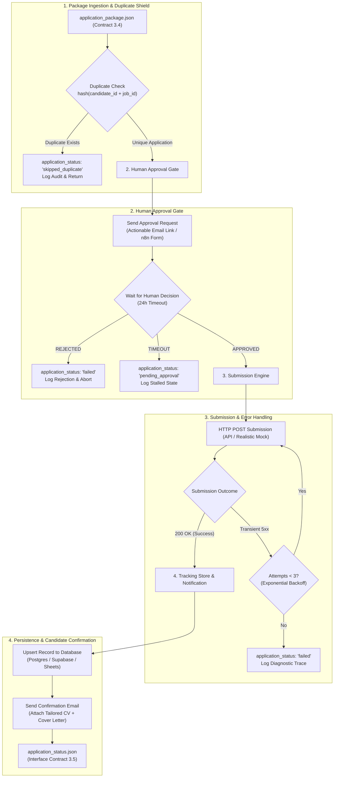

# Module 5: Application & Tracking
**Owner:** Student 5 (Automation & Operations Engineer)

## Overview
This module receives a verified application package (`application_package.json`), checks against past submissions to prevent duplicate applications, pauses execution for **Human Approval**, dispatches the application via API or realistic mock, persists complete lifecycle records to a tracking database, sends candidate confirmations with attached PDFs, and manages retries and failure logging.

---

## Module Architecture & Dataflow

---

## Detailed Node Responsibilities

| Stage | Node Name | Description | Key Fault Tolerances |
|---|---|---|---|
| **1. Duplicate Shield** | `Duplicate Check` | Checks database for existing `candidate_id` + `job_id` record. | Prevents spamming employers with duplicate submissions. |
| **2. Approval Gate** | `Human Approval Gate` | Pauses workflow and presents match score, tailored CV, and cover letter to human. | Mandatory safety gate; timeout handling. |
| **3. Submission** | `Submission Dispatcher` | Dispatches application payload to company endpoint (or mock server). | Explicit retry loop with exponential backoff on 5xx errors. |
| **4. Persistence** | `Database Upsert` | Records timestamps, status (`submitted`, `failed`), and submission attempts. | Connection pooling and retry on database unavailability. |
| **5. Confirmation** | `Email Notification` | Dispatches email confirmation to candidate with generated PDF documents attached. | Attachment verification before sending. |

---

## Inputs and Outputs

- **Sample Input File:** [`test_data/sample_application_package.json`](./test_data/sample_application_package.json)
- **Output Schema:** [`../contracts/schemas/application_status.schema.json`](../contracts/schemas/application_status.schema.json)
- **Sample Output:** [`../contracts/sample_payloads/sample_application_status.json`](../contracts/sample_payloads/sample_application_status.json)

---

## Evaluation: 10 Failure & Edge Scenarios

Per Section 4 requirements, this module is validated against **10 discrete scenarios**:
1. **Happy Path:** Approved and successfully submitted.
2. **Human Rejection:** Explicit rejection at the approval gate.
3. **Approval Timeout:** Human does not respond within the configured window.
4. **Duplicate Blocked:** Immediate bypass when candidate has already applied to this job ID.
5. **Transient Failure Recovery:** Simulated 503 error recovered on retry attempt #2.
6. **Permanent Failure:** 400 Bad Request caught, logged with stage diagnostics without retrying.
7. **Email Service Down:** Application submitted to employer, email failure flagged in output.
8. **Missing Attachment:** Detected before email dispatch; fails with explicit error code.
9. **Database Store Unavailable:** Fallback logging to local disk without dropping state.
10. **Malformed Contract Ingestion:** Schema validator rejects input before triggering approval.

---

## Decision Records (ADRs)
- [`decisions/ADR-001-approval-channel.md`](./decisions/ADR-001-approval-channel.md): Evaluation of Actionable Emails vs n8n Form vs Webhook Bots.
- [`decisions/ADR-002-storage-system.md`](./decisions/ADR-002-storage-system.md): Comparison of PostgreSQL, Supabase, and Google Sheets for audit persistence.

---

## Checklist to Mark Done
- [x] Runs standalone with a sample mock package on Day 1.
- [x] Absolute rule enforced: Nothing is EVER submitted without explicit human approval.
- [x] Repeated executions of the same job never result in duplicate submissions.
- [x] Every failure mode ends in an explicit, structured status payload—never a silent failure.
